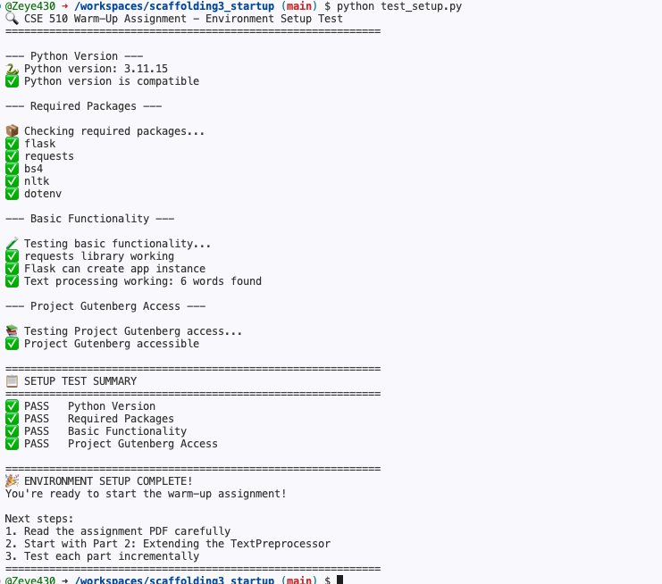
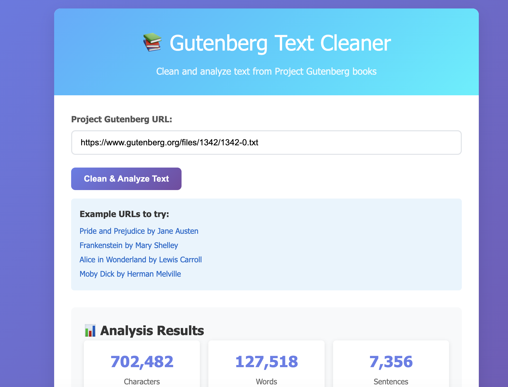

# CSE 510 Warm-Up Assignment: Text Preprocessing Web Service

A Flask web service that fetches, cleans, and analyzes classic literature from Project Gutenberg.

## Screenshots

### Environment Setup

### Analysis Results

## Features

- Fetch text directly from Project Gutenberg URLs
- Clean and normalize raw text (removes headers/footers, standardizes formatting)
- Statistical analysis: character count, word count, sentence count, average lengths, top 10 words
- 3-sentence extractive summary
- REST API endpoints for programmatic access

## Project Structure

scaffolding3_startup/
├── app.py                  # Flask application with API endpoints
├── starter_preprocess.py   # TextPreprocessor class
├── test_setup.py           # Environment validation
├── requirements.txt        # Dependencies
├── screenshots/            # Screenshots for submission
└── templates/
└── index.html          # Web interface

## Setup

1. Fork this repo and open in GitHub Codespaces

2. Install dependencies:
pip install -r requirements.txt

3. Verify environment:
python test_setup.py

4. Run the app:
python app.py

5. Open the forwarded port 5000 in your browser
